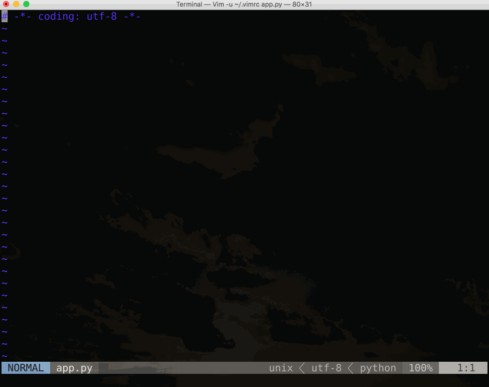

# vim-snowflake

An asynchronous Python source code checker for Vim.



## Features

### Realtime check

A lot of style checker triggered by save buffer.

vim-snowflake detect source code change immediately and upddate results(no need to save buffer).

### More realtime

TextChange and TextChangeI event can detect more realtime.

```viml
autocmd TextChanged,TextChangedI *.py call snowflake#flake8#run()
```

### Async

Using Vim's job and channels features for asynchronous check.

### Style checkers

- Flake8

## Configurations

### Integrate with other plugins

snowflake have some hook points to inject various functions.

|Hook point   |Hook timing                                   |
|:------------|:---------------------------------------------|
|`before_init`|Inject to snowflake#init() before called      |
|`after_init` |Inject to snowflake#init() after called       |
|`before_run` |Inject to snowflake#flake8#run() before called|
|`after_run`  |Inject to snowflake#flake8#run() after called |

#### Example

```viml
function! s:snowflake_after(...)
  execute ':QuickfixStatusEnable'
  execute ':HierUpdate'
endfunction

let g:snowflake_callbacks = {
  \ 'after_init': function('snowflake#flake8#run'),
  \ 'after_run': function('s:snowflake_after')
  \ }
```
- Execute right after source code open
- Show QuickFix error in statusline, and highlight QuickFix errors run
  quickfixstatus.vim and vim-hier.

## License

New BSD License
